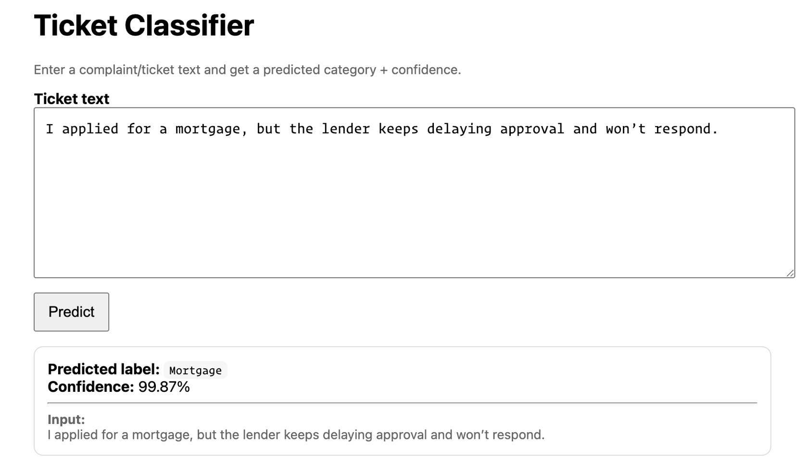

# Ticket Classification with NLP

An end-to-end NLP project for automatic ticket classification, progressing from
classical machine learning baselines to modern transformer-based models.

The project is designed with a **production-oriented structure**, including:

- clean data loading and preprocessing
- reproducible training via CLI
- unit tests for core components
- model evaluation and comparison
- a FastAPI inference service
- containerized deployment with Docker

## 📌 Project Overview

Customer support teams receive large volumes of free-text tickets every day.
This project focuses on automatically classifying support tickets into predefined product categories based on the textual description provided by users.

The project was developed incrementally, starting with a strong classical NLP baseline and evolving toward modern transformer-based models.

Key aspects of the project include:

- Classical NLP pipelines using **TF-IDF + linear classifiers**
- Reproducible training via CLI and centralized configuration
- Hyperparameter tuning and proper evaluation practices
- Fine-tuned **transformer-based models** (DistilBERT, RoBERTa)
- A **FastAPI-based inference service** for real-time predictions
- **Dockerized deployment** with a self-contained model image

The result is an end-to-end NLP system that reflects how text classification models are built,
evaluated, and deployed in real-world production settings.

## 📊 Dataset

**Source:** Financial complaint/ticket dataset

**Input:** Free-text description (complaint_what_happened)

**Target:** Product category (product)

**Preprocessing:**

- Remove missing text or labels

- Keep the top 5 most frequent classes

- Divide data into train/validation/test subsets

### Data Availability

The dataset is **not included in this repository**.

To run training locally:

1. Download the dataset from:  
   👉 https://www.kaggle.com/code/abhishek14398/automatic-ticket-classification-case-study-nlp/input

2. Unzip and place it in:

   👉 your project root > data> raw

> For example: data/raw/tickets.json

## 🧱 Project Structure

```text
2.TicketClassification/
├── src/
│ └── ticket_classifier/
│ ├── data_loader.py # Dataset loading and splitting
│ ├── pipeline.py # TF-IDF + classical ML pipelines
│ ├── train.py # CLI training for classical models
│ ├── train_transformer.py # Transformer training and evaluation
│ ├── evaluate.py # Evaluation utilities
│ ├── config.py # Centralized configuration
│ └── init.py
│
├── api/
│ ├── app.py # FastAPI inference service
│ ├── schemas.py # Request/response schemas
│ └── main.py # Local API entry point
│
├── data/
│ └── raw/ # Raw dataset files (not tracked)
│
├── models/
│ └── *.joblib # Saved classical ML models (optional, local)
│
├── artifacts/
│ └── transformer_runs/ # Transformer checkpoints (not tracked)
│
├── tests/
│ ├── conftest.py # Pytest shared fixtures
│ ├── test_data_loader.py
│ ├── test_pipeline.py
│ ├── test_evaluate.py
│ └── test_transformer_prep.py # Transformer data prep & sanity checks
│
├── Dockerfile # Containerized inference service
├── requirements.txt # Runtime dependencies
├── .dockerignore
├── .gitignore
└── README.md
```

## 🧠 Modeling Approach

### 1️⃣ Classical Machine Learning Models

**🔹Text Representation**

    TFIDF Vectorization:

        - Configurable via config.py

        - N-grams: (1, 3)

        - Max_features: 10000

        - Stop-word removal (english)

This representation provides a strong, efficient baseline for linear classifiers on high-dimensional text data.

**🔹 Classifiers**

- Logistic Regression
  - class_weight="balanced"

- Linear SVM (LinearSVC)
  - class_weight="balanced"

Both models are implemented through a single configurable pipeline, ensuring consistent preprocessing, training, and evaluation.

**🔧 Training & Hyperparameter Tuning**

Training is done via a command-line interface (CLI).

1. Training without tuning:

   PYTHONPATH=src python -m ticket_classifier.train --classifier logreg

   PYTHONPATH=src python -m ticket_classifier.train --classifier svc

2. Training with GridSearchCV:

   PYTHONPATH=src python -m ticket_classifier.train --classifier logreg --tune

   PYTHONPATH=src python -m ticket_classifier.train --classifier svc --tune

**📈 Evaluation**

Evaluation includes:

- Accuracy

- Precision / Recall / F1-score (per class)

- Macro & weighted averages

**Example performance (Top 5 classes):**

Accuracy: ~78%

Weighted F1: ~0.78

> These results are typical for TF-IDF-based models on semantically overlapping ticket categories and provide a strong baseline.

**Testing**

The project includes a pytest-based test covering:

- Pipeline construction

- TF-IDF configuration consistency

- Fit / predict sanity checks

- Data loading validation

- Integration tests on real data

> For running the tests: PYTHONPATH=src pytest

**⚙️ Configuration**

All reusable parameters are centralized in config.py, including:

- TF-IDF settings

- Random seed

- Dataset split sizes

- Paths

> This ensures consistency across training, testing, and experiments.

### 2️⃣ Transformer-based Models

**🔹 Model Architectures**

Transformer-based models are fine-tuned for sequence classification using **Hugging Face**.

- Models explored: DistilBERT, RoBERTa

- Input: Raw ticket text

- Output:
  - predicted_label: Product category (Top 5 classes)
  - confidence score

**🔹 Tokenization**

- Model-specific tokenizers (AutoTokenizer)

- Truncation applied to long texts

- Configurable maximum sequence length (e.g., 128 tokens)

**🔧 Transformer Training (CLI)**
Transformer fine-tuning is implemented in train_transformer.py and is fully configurable via CLI.

**Key features:**

- Fine-tuning with Hugging Face Trainer

- Configurable batch size, learning rate, epochs, and model choice

- Micro-training mode for fast iteration

- Automatic best-model selection based on weighted F1

**Train RoBERTa (full train/val split):**

```text
ACCELERATE_USE_CPU=1 PYTHONPATH=src python -m ticket_classifier.train_transformer \
 --model-name roberta-base --max-len 128 \
--train-n 11711 --val-n 1674 --epochs 3 --train-batch 4
```

**Train DistilBERT (faster baseline):**

```text
ACCELERATE_USE_CPU=1 PYTHONPATH=src python -m ticket_classifier.train_transformer \
 --model-name distilbert-base-uncased --max-len 128 \
 --train-n 11711 --val-n 1674 --epochs 3 --train-batch 4
```

**Quick micro-run (debug the training loop fast):**

```text
ACCELERATE_USE_CPU=1 PYTHONPATH=src python -m ticket_classifier.train_transformer \
 --model-name roberta-base --max-len 128 \
 --train-n 3000 --val-n 1000 --epochs 1 --train-batch 4
```

**Change learning rate / batch sizes:**

```text
ACCELERATE_USE_CPU=1 PYTHONPATH=src python -m ticket_classifier.train_transformer \
--model-name roberta-base --max-len 128 \
--train-n 11711 --val-n 1674 --epochs 3 --lr 1e-5 \--train-batch 4 --eval-batch 16
```

> Models are saved under: artifacts/transformer_runs/<run_name>/best_model

**📈 Evaluation**

Transformer models are evaluated using the same metrics as classical models.

Example performance (Top 5 classes):

**RoBERTa (fine-tuned):**

- **Accuracy:** ~80%

- **Weighted F1:** ~0.80

This represents an improvement over TF-IDF baselines.

## 🚀 Deployment & Inference

This project exposes a FastAPI inference service for ticket classification using a fine-tuned RoBERTa model hosted on Hugging Face Hub.

The model is not stored in this repository. It is downloaded automatically at runtime.

**🔹 Model Source (Hugging Face Hub)**

Model ID:

```
mahsabr/ticket-classifier-roberta-top5
```

The API loads the model using:

```
AutoTokenizer.from_pretrained(MODEL_ID)
AutoModelForSequenceClassification.from_pretrained(MODEL_ID)
```

✔ No local artifacts required
✔ No Hugging Face account required (public model)

### ▶️ Run Locally (Python)

**Steps**

```
# Clone the repo

git clone https://github.com/<your-username>/TicketClassification.git
cd TicketClassification

# Create & activate virtual environment

python -m venv venv
source venv/bin/activate

# Install dependencies

pip install -r requirements.txt

# Set model source

export MODEL_ID=mahsabr/ticket-classifier-roberta-top5
export PYTHONPATH=src

# Start the API

uvicorn api.app:app --reload
```

API will be available at:

```
http://127.0.0.1:8000
```

### 🐳 Run with Docker (Recommended)

**Build the image**

```
docker build -t ticket-classifier-api .
```

**Run the container**

```
docker run -p 8000:8000 \
 -e MODEL_ID=mahsabr/ticket-classifier-roberta-top5 \
 ticket-classifier-api
```

**🔍 Inference Example**

```
curl -X POST "http://127.0.0.1:8000/predict" \
 -H "Content-Type: application/json" \
 -d '{"text":"My credit card was charged twice and the bank refused to reverse it."}'
```

**Response:**

```
{
"text": "My credit card was charged twice and the bank refused to reverse it.",
"predicted_label": "Credit card or prepaid card",
"confidence": 0.98
}
```

**❤️ Health Check**

```
curl http://127.0.0.1:8000/health
```

**Response:**

```
{"status":"ok"}
```

.

## 🖥️ Web Interface (HTML Landing Page)



In addition to the REST API, the project includes a simple HTML landing page for interactive predictions.

This allows users to:

- Paste a ticket/complaint text

- Click a button to run inference

- View the predicted category and confidence score instantly

> The UI is served directly by FastAPI (no separate frontend stack).

**🐳 Docker Support**

The landing page is implemented using container-safe paths, ensuring it works consistently:

- Local development

- Docker containers

- Cloud deployments (e.g. Cloud Run)

> No extra configuration is required.

### ▶️ Access the Web UI

When the API is running (locally or via Docker), open:

```
http://127.0.0.1:8000/
```

### How It Works

- The page is served from a static HTML file.

- User input is sent to the /predict endpoint via fetch

- The API returns:
  - predicted_label

  - confidence (softmax probability)

> This provides a lightweight demo experience without additional frontend tooling

## ✅ Summary

- Fine-tuned transformer model hosted on Hugging Face Hub

- FastAPI inference service with confidence scores

- Model auto-downloads at startup (no local artifacts required)

- Dockerized for reproducible deployment

- Includes a web-based HTML landing page for interactive predictions

- Runs consistently locally, in Docker, and in cloud environments

## ☁️ Cloud Deployment (Ready)

This Docker image is cloud-ready and can be deployed to:

- Google Cloud Run

- AWS ECS / App Runner

- Azure Container Apps

- Kubernetes

## Next Steps

Planned improvements:

1. Deploy to Cloud

2. CI pipeline (GitHub Actions)

3. Error analysis & label refinement

## Status

🚧 Project is in progress
